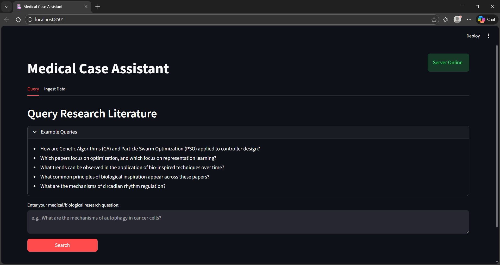
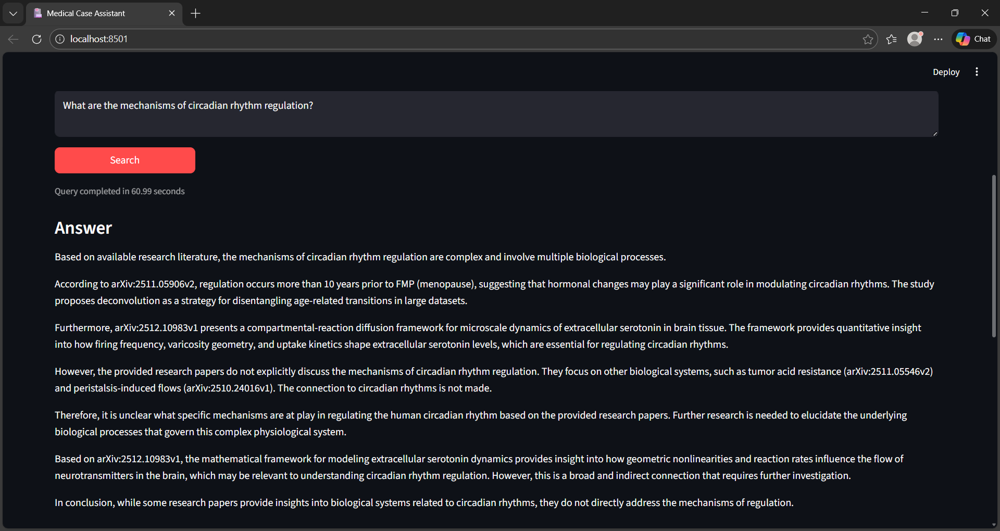
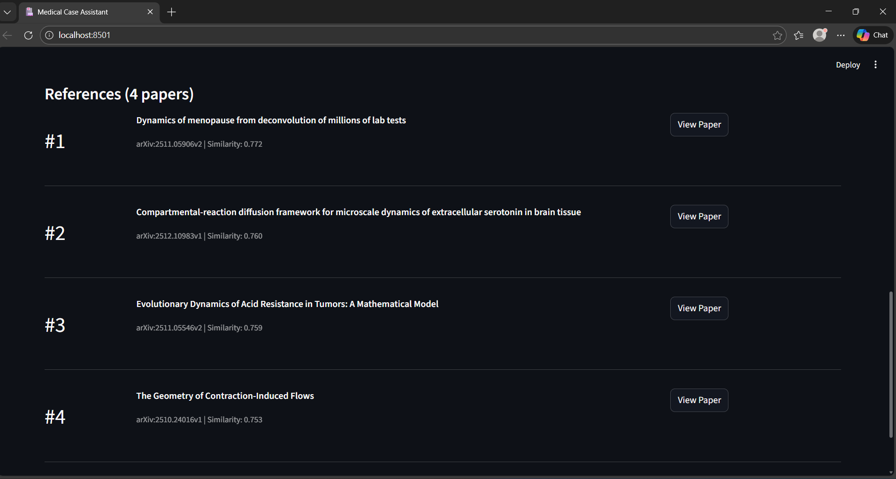

# Medical Case Assistant  
---

## Overview

The **Medical Case Assistant** is a research-oriented system designed to support the exploration of medical and biomedical literature using a **Retrieval-Augmented Generation (RAG)** framework. The system retrieves relevant research papers from **arXiv** and generates answers grounded in those sources using large language models.

---

## Screenshots

### Web Interface (Streamlit)

### Query Response

### Literature Reference List

---

## System Functionality

The system performs the following steps:

1. Retrieves biomedical research papers from arXiv (q-bio categories)
2. Splits abstracts into smaller text segments
3. Converts text segments into semantic embeddings
4. Stores embeddings in a vector-enabled database
5. Retrieves relevant literature for a user query
6. Generates an answer grounded in retrieved sources with citations

All generated responses reference the original arXiv papers used.

---

## Architecture Overview

User Query
↓
Vector Retrieval (MongoDB Atlas)
↓
Relevant Research Chunks
↓
LLM-Based Answer Generation
↓
Answer with Citations

### Main Components

- **Frontend (optional)**: Streamlit web interface
- **Backend**: FastAPI application
- **Data Source**: arXiv API
- **Embeddings**: `mxbai-embed-large` (via Ollama)
- **Language Model**: `llama3.2` (via Ollama)
- **Database**: MongoDB Atlas with vector search

---

## Usage Modes

### 1. Streamlit Web Interface
- Interactive ingestion and querying
- Visual feedback and citation display
- Suitable for learning and demonstrations

### 2. REST API (FastAPI)
- Programmatic access to ingestion and querying
- Suitable for automation and integration
- Interactive documentation via Swagger UI   

---

## Data Ingestion

During ingestion, the system:

- Fetches papers from arXiv
- Cleans and chunks abstracts
- Generates semantic embeddings
- Stores embeddings and metadata in MongoDB

Ingestion can be initiated via:
- Streamlit UI
- REST API endpoint

---

## Querying the System

Users submit a natural-language research question, for example:

> *What are the mechanisms of circadian rhythm regulation?*

The system returns:
- A synthesized answer
- A list of cited arXiv papers
- Relevance scores for retrieved documents

---

## Example Research Questions

- How are Genetic Algorithms (GA) and Particle Swarm Optimization (PSO) applied to controller design?
- Which papers focus on optimization, and which focus on representation learning?
- What trends can be observed in the application of bio-inspired techniques over time?
- What common principles of biological inspiration appear across these papers?

---

## Configuration

System parameters are defined in the `.env` file, including:

- Text chunk size and overlap
- Number of retrieved documents
- Similarity score threshold
- Model configuration

These parameters enable experimentation and evaluation of retrieval performance.

---

## Key Features

- Retrieval-Augmented Generation (RAG)
- Semantic vector search
- Citation-backed responses
- Modular, readable codebase